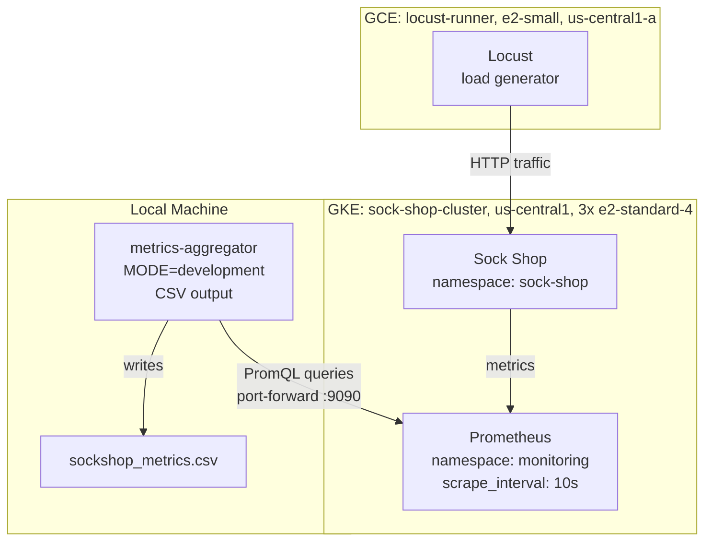
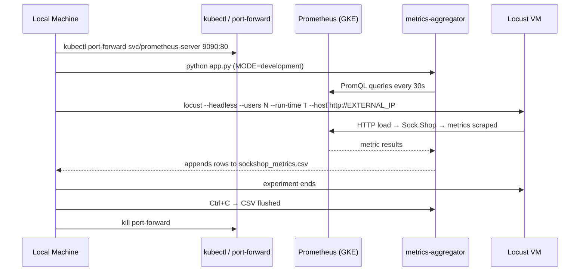

# Design Document: GKE Data Collection Pipeline

## Overview

Deploy the Sock Shop microservices demo to a GKE cluster on GCP, instrument it with Prometheus, drive load via a Locust VM, and collect metrics locally using the existing metrics aggregator in development mode (CSV output). The goal is to produce a new `sockshop_metrics.csv` dataset from a real cloud environment to retrain the ML models.

The pipeline runs in three tiers: GKE (Sock Shop + Prometheus), a GCE VM (Locust load generator), and the local machine (metrics aggregator port-forwarded to Prometheus).

## Architecture

## Components and Interfaces

### GKE Cluster

**Purpose**: Hosts Sock Shop and Prometheus in a stable, reproducible cloud environment.

- 3 nodes, `e2-standard-4` (4 vCPU / 16 GB each) → 12 vCPU / 48 GB total
- Region: `us-central1`, release channel: `regular`, autoupgrade disabled
- Sock Shop deployed from upstream manifest into `sock-shop` namespace
- `front-end` service exposed as `LoadBalancer` to get a stable external IP

### Prometheus (Helm)

**Purpose**: Scrapes per-service metrics from Sock Shop at 10s intervals.

- Installed via `prometheus-community/prometheus` Helm chart
- Namespace: `monitoring`
- `scrape_interval` and `evaluation_interval`: 5s (matches local Prometheus config)
- `alertmanager` and `pushgateway` disabled (not needed for data collection)
- Accessed locally via `kubectl port-forward` on port 9090

### Locust VM

**Purpose**: Generates realistic stochastic e-commerce load against the Sock Shop front-end.

- GCE instance: `locust-runner`, `e2-small`, `ubuntu-2204-lts`, zone `us-central1-a`
- Load scripts: `kafka-structured/load-testing/src/locustfile.py` + `load_shapes.py`
- Four load patterns: Constant, Ramp, Spike, Step

### Metrics Aggregator (Local, Development Mode)

**Purpose**: Polls Prometheus via port-forward and writes feature vectors to CSV.

- Entry point: `kafka-structured/services/metrics-aggregator/app.py`
- `MODE=development` → writes to `OUTPUT_DIR/sockshop_metrics.csv`
- `POLL_INTERVAL_SEC=30` → one row per service per 30 seconds
- Features collected: `request_rate_rps`, `error_rate_pct`, `p50/p95/p99_latency_ms`, `cpu_usage_pct`, `memory_usage_mb`, `delta_rps`, `delta_p95_latency_ms`, `delta_cpu_usage_pct`, `sla_violated`
- Services tracked: `carts`, `catalogue`, `front-end`, `orders`, `payment`, `queue-master`, `shipping`, `user`

## Data Models

### CSV Row Schema

Matches the existing `sockshop_metrics.csv` schema (11 features + label):

| Column | Type | Description |
|---|---|---|
| `timestamp` | ISO-8601 string | UTC poll time |
| `service` | string | Sock Shop service name |
| `request_rate_rps` | float | Requests per second (1m rate) |
| `error_rate_pct` | float | % 5xx errors |
| `p50_latency_ms` | float | Median latency |
| `p95_latency_ms` | float | 95th percentile latency |
| `p99_latency_ms` | float | 99th percentile latency |
| `cpu_usage_pct` | float | CPU usage % |
| `memory_usage_mb` | float | Resident memory MB |
| `delta_rps` | float | Change in RPS since last poll |
| `delta_p95_latency_ms` | float | Change in p95 latency |
| `delta_cpu_usage_pct` | float | Change in CPU % |
| `sla_violated` | int | 0 (placeholder; label added post-collection) |

## Load Patterns

Four experiment runs, each targeting the Sock Shop `EXTERNAL_IP`:

| Pattern | Locust file | Duration | User range |
|---|---|---|---|
| Constant | `locustfile_constant.py` | 20 min | 50 users steady |
| Ramp | `locustfile_ramp.py` | 10 min | 10→150→10 users |
| Spike | `locustfile_spike.py` | 10 min | 10 base + spikes to 100 |
| Step | `locustfile_step.py` | 10 min | 50→200→100→300→50 |

## Cost Management

- Cluster resize to 0 nodes between sessions preserves deployments and stops compute billing
- Locust VM stopped between sessions
- Resume: resize cluster back to 3 nodes, start VM

## Sequence: Single Experiment Run

## Prerequisites (Already Complete)

- `gcloud` CLI, `kubectl`, GKE auth plugin installed
- GCP project `sock-shop-research` created with required APIs enabled
- Region/zone set to `us-central1` / `us-central1-a`
- `gcloud auth login` completed
- Helm installed (or to be installed in Phase 4)
