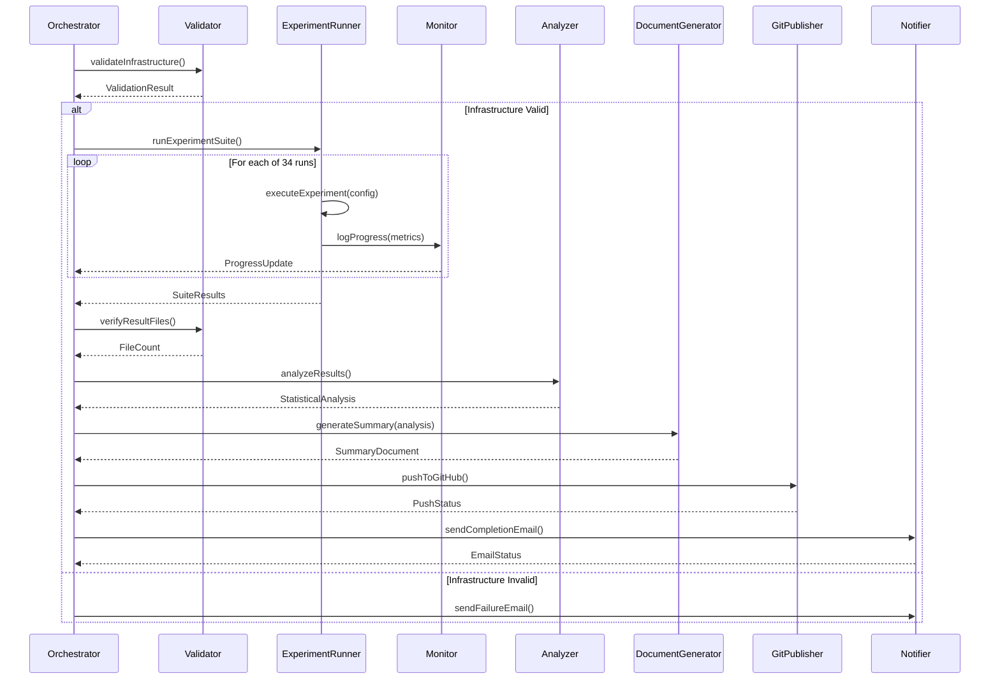

# Design Document: Graduation Experiment Pipeline

## Overview

An automated orchestration system for executing a 34-run experiment suite comparing proactive vs reactive autoscaling across 4 load patterns on Kubernetes. The pipeline validates infrastructure, executes experiments sequentially with rich progress monitoring, analyzes results statistically, generates summary documentation, and notifies completion via email. Designed for unattended overnight execution with robust error handling and recovery mechanisms.

## Main Algorithm/Workflow



## Core Interfaces/Types

```lean
-- Infrastructure configuration
structure InfraConfig where
  targetCluster : String := "gke_grad-phca_us-central1-a_sock-shop-cluster"
  pipelineCluster : String := "gke_grad-phca_us-central1-a_pipeline-cluster"
  prometheusUrl : String := "http://34.170.213.190:9090"
  locustVmIp : String := "35.222.116.125"
  locustSshUser : String := "User"
  locustSshKey : String := "~/.ssh/google_compute_engine"
  sockShopIp : String := "104.154.246.88"
  sloLatencyMs : Float := 35.68
  deriving Repr

-- Experiment configuration
structure ExperimentConfig where
  totalRuns : Nat := 34
  loadPatterns : List String := ["constant", "sine", "spike", "step"]
  conditions : List String := ["proactive", "reactive"]
  repetitionsPerPattern : Nat
  runDurationMinutes : Nat := 6
  intervalSeconds : Nat := 30
  resultsDir : String := "kafka-structured/experiments/results"
  deriving Repr

-- Validation result
inductive ValidationResult where
  | success : ValidationResult
  | failure : String → ValidationResult
  deriving Repr

-- Experiment run result
structure ExperimentRun where
  runId : Nat
  condition : String
  pattern : String
  startTime : String
  endTime : String
  sloViolations : Nat
  avgLatencyMs : Float
  resourceUsage : Float
  success : Bool
  errorMsg : Option String
  deriving Repr

-- Analysis result
structure AnalysisResult where
  perPatternTables : List String
  globalSummary : String
  statisticalTests : String
  perServiceWinners : String
  deriving Repr

-- Pipeline state
structure PipelineState where
  phase : String
  completedRuns : Nat
  failedRuns : List Nat
  startTime : String
  estimatedCompletion : String
  deriving Repr
```

## Key Functions with Formal Specifications

### Function 1: validateInfrastructure()

```lean
def validateInfrastructure (config : InfraConfig) : IO ValidationResult
```

**Preconditions:**
- `config` contains valid non-empty strings for all endpoints
- Network connectivity is available
- SSH key file exists at specified path

**Postconditions:**
- Returns `ValidationResult.success` if and only if all infrastructure components are reachable
- Returns `ValidationResult.failure(msg)` with descriptive error if any component fails
- No side effects on infrastructure state

**Loop Invariants:** N/A (sequential validation checks)

### Function 2: runExperimentSuite()

```lean
def runExperimentSuite (config : ExperimentConfig) (infraConfig : InfraConfig) : IO (List ExperimentRun)
```

**Preconditions:**
- Infrastructure validation has passed
- `config.totalRuns` equals `config.loadPatterns.length * config.conditions.length * config.repetitionsPerPattern`
- Results directory exists and is writable
- No `--pause-before-start` flag is used

**Postconditions:**
- Returns list of `ExperimentRun` results with length ≤ `config.totalRuns`
- Each successful run has corresponding `.jsonl` file in results directory
- Failed runs are logged but do not halt suite execution
- Progress log file contains complete execution trace

**Loop Invariants:**
- For each iteration `i`: All runs `0..i-1` have been attempted and logged
- Failed runs are recorded in state but do not affect subsequent runs
- Result files for successful runs exist and are valid JSON

### Function 3: executeExperiment()

```lean
def executeExperiment (runId : Nat) (condition : String) (pattern : String) (config : ExperimentConfig) : IO ExperimentRun
```

**Preconditions:**
- `runId` is unique within the suite
- `condition ∈ config.conditions`
- `pattern ∈ config.loadPatterns`
- Kubernetes cluster is accessible
- Locust VM is reachable via SSH

**Postconditions:**
- Returns `ExperimentRun` with `success = true` if experiment completes without errors
- Returns `ExperimentRun` with `success = false` and `errorMsg` if experiment fails
- Creates `.jsonl` result file if successful
- Logs progress metrics at `config.intervalSeconds` intervals
- Cleans up Kubernetes resources after completion

**Loop Invariants:**
- During metric collection: All previous intervals have been logged
- Resource cleanup occurs regardless of success/failure

### Function 4: monitorProgress()

```lean
def monitorProgress (state : PipelineState) (logFile : String) : IO Unit
```

**Preconditions:**
- `logFile` exists and is readable
- `state` reflects current pipeline execution status

**Postconditions:**
- Displays last 20 lines of log file
- Updates console with progress dashboard
- No modifications to log file or pipeline state

**Loop Invariants:** N/A (single read operation)

### Function 5: verifyResultFiles()

```lean
def verifyResultFiles (resultsDir : String) (expectedCount : Nat) : IO (Nat × List String)
```

**Preconditions:**
- `resultsDir` exists and is readable
- `expectedCount = 34`

**Postconditions:**
- Returns tuple of (actualCount, missingRunIds)
- `actualCount` equals number of non-diagnostic `.jsonl` files
- `missingRunIds` contains identifiers of failed runs if `actualCount < expectedCount`
- No modifications to file system

**Loop Invariants:**
- For each file checked: Count increments only for valid experiment result files
- Diagnostic files (prefix `diag_*`) are excluded from count

### Function 6: analyzeResults()

```lean
def analyzeResults (resultsDir : String) : IO AnalysisResult
```

**Preconditions:**
- At least one valid result file exists in `resultsDir`
- `full_analysis.py` script exists and is executable
- Python environment has required dependencies

**Postconditions:**
- Returns `AnalysisResult` containing statistical analysis
- Creates `experiment_analysis_output.txt` file
- Performs Mann-Whitney U tests for statistical significance
- Generates per-pattern comparison tables
- No modifications to input result files

**Loop Invariants:** N/A (delegates to Python script)

### Function 7: generateSummary()

```lean
def generateSummary (analysis : AnalysisResult) (timestamp : String) : IO String
```

**Preconditions:**
- `analysis` contains valid non-empty strings for all fields
- `timestamp` is valid ISO 8601 format

**Postconditions:**
- Returns markdown-formatted summary document
- Creates `EXPERIMENT_RESULTS_SUMMARY.md` file
- Includes test configuration, comparison tables, global metrics, per-pattern breakdown
- File is valid markdown and human-readable

**Loop Invariants:** N/A (single document generation)

### Function 8: pushToGitHub()

```lean
def pushToGitHub (repoPath : String) (commitMsg : String) : IO Bool
```

**Preconditions:**
- `repoPath` is valid Git repository
- Working directory has uncommitted changes
- Git credentials are configured
- Network connectivity to GitHub is available

**Postconditions:**
- Returns `true` if push succeeds
- Returns `false` if any Git operation fails
- All result files, analysis output, and summary are committed
- Remote repository is updated with new commit

**Loop Invariants:** N/A (sequential Git operations)

### Function 9: sendCompletionEmail()

```lean
def sendCompletionEmail (recipient : String) (subject : String) (body : String) : IO Bool
```

**Preconditions:**
- `recipient` is valid email address
- SMTP credentials are available or browser automation is possible
- Network connectivity is available

**Postconditions:**
- Returns `true` if email is sent successfully
- Returns `false` if all delivery methods fail
- Attempts SMTP first, falls back to browser automation
- No duplicate emails are sent

**Loop Invariants:** N/A (sequential delivery attempts)

## Algorithmic Pseudocode

### Main Pipeline Orchestration

```lean
def orchestratePipeline (config : ExperimentConfig) (infraConfig : InfraConfig) : IO Unit := do
  -- Precondition: All configuration parameters are valid
  let startTime ← getCurrentTime
  
  -- Phase 1: Validate infrastructure
  IO.println "Phase 1: Validating infrastructure..."
  let validationResult ← validateInfrastructure infraConfig
  
  match validationResult with
  | ValidationResult.failure msg => do
      IO.println s!"Infrastructure validation failed: {msg}"
      let _ ← sendFailureEmail "ahmedd.eldarawi@gmail.com" msg
      return ()
  | ValidationResult.success => do
      IO.println "Infrastructure validation passed"
      
      -- Phase 2: Execute experiment suite
      IO.println "Phase 2: Launching 34-run experiment suite..."
      let results ← runExperimentSuite config infraConfig
      
      -- Phase 3: Verify result files
      IO.println "Phase 3: Verifying result files..."
      let (fileCount, missingRuns) ← verifyResultFiles config.resultsDir config.totalRuns
      
      if fileCount < config.totalRuns then
        IO.println s!"Warning: Only {fileCount}/34 runs completed. Missing: {missingRuns}"
      else
        IO.println "All 34 runs completed successfully"
      
      -- Phase 4: Analyze results
      IO.println "Phase 4: Running statistical analysis..."
      let analysis ← analyzeResults config.resultsDir
      
      -- Phase 5: Generate summary document
      IO.println "Phase 5: Generating results summary..."
      let timestamp ← getCurrentTime
      let _ ← generateSummary analysis timestamp
      
      -- Phase 6: Push to GitHub
      IO.println "Phase 6: Pushing to GitHub..."
      let pushSuccess ← pushToGitHub "d:\\Projects\\Grad\\PHCA" 
                                      "Final experiment results: 34-run suite with analysis"
      
      if !pushSuccess then
        IO.println "Warning: GitHub push failed"
      
      -- Phase 7: Send completion email
      IO.println "Phase 7: Sending completion email..."
      let emailSuccess ← sendCompletionEmail 
                          "ahmedd.eldarawi@gmail.com"
                          "PHCA Experiment Results Ready"
                          "Congrats! The full 34-run experiment suite completed successfully. Results and analysis have been pushed to GitHub."
      
      if !emailSuccess then
        IO.println "Warning: Email notification failed"
      
      let endTime ← getCurrentTime
      IO.println s!"Pipeline completed in {calculateDuration startTime endTime}"
      
  -- Postcondition: All phases executed, results persisted, notifications sent
```

**Preconditions:**
- Configuration objects are well-formed
- File system paths are valid
- Network connectivity is available
- Required external scripts exist

**Postconditions:**
- All 7 phases are executed in order
- Failures in non-critical phases (email, GitHub) do not halt pipeline
- Complete execution trace is logged
- User is notified of completion or failure

**Loop Invariants:** N/A (sequential phase execution)

### Infrastructure Validation Algorithm

```lean
def validateInfrastructure (config : InfraConfig) : IO ValidationResult := do
  -- Check Prometheus availability
  let prometheusOk ← httpGet config.prometheusUrl
  if !prometheusOk then
    return ValidationResult.failure "Prometheus unreachable"
  
  -- Check Locust VM SSH connectivity
  let locustOk ← sshTest config.locustVmIp config.locustSshUser config.locustSshKey
  if !locustOk then
    return ValidationResult.failure "Locust VM SSH failed"
  
  -- Check Kubernetes cluster connectivity
  let k8sOk ← kubectlTest config.targetCluster
  if !k8sOk then
    return ValidationResult.failure "Kubernetes cluster unreachable"
  
  -- Check Sock Shop endpoint
  let sockShopOk ← httpGet s!"http://{config.sockShopIp}"
  if !sockShopOk then
    return ValidationResult.failure "Sock Shop unreachable"
  
  return ValidationResult.success
```

**Preconditions:**
- All endpoint URLs and IPs are syntactically valid
- Network interface is active
- SSH key file exists

**Postconditions:**
- Returns success if and only if all 4 checks pass
- Returns failure with first failing component
- No retries (fail fast for quick feedback)

**Loop Invariants:**
- For each check: All previous checks have passed
- Early termination on first failure

### Experiment Suite Execution Algorithm

```lean
def runExperimentSuite (config : ExperimentConfig) (infraConfig : InfraConfig) : IO (List ExperimentRun) := do
  let mut results : List ExperimentRun := []
  let mut runId := 1
  
  -- Generate experiment schedule
  let schedule ← generateSchedule config
  
  -- Execute each experiment
  for (condition, pattern) in schedule do
    IO.println s!"Starting run {runId}/34: {condition} - {pattern}"
    
    let startTime ← getCurrentTime
    let result ← executeExperiment runId condition pattern config
    let endTime ← getCurrentTime
    
    results := result :: results
    
    if result.success then
      IO.println s!"Run {runId} completed: {result.sloViolations} violations, {result.avgLatencyMs}ms avg latency"
    else
      IO.println s!"Run {runId} failed: {result.errorMsg.getD "Unknown error"}"
    
    runId := runId + 1
    
    -- Brief pause between runs for cluster stabilization
    IO.sleep 5000  -- 5 seconds
  
  return results.reverse
```

**Preconditions:**
- Infrastructure is validated
- Schedule contains exactly 34 experiments
- Results directory is writable

**Postconditions:**
- Returns list of all experiment results (successful and failed)
- Each successful run has persisted result file
- Failed runs do not halt suite execution
- Progress is logged for each run

**Loop Invariants:**
- `runId` equals number of completed runs + 1
- `results.length` equals number of completed runs
- All completed runs have been logged

### Single Experiment Execution Algorithm

```lean
def executeExperiment (runId : Nat) (condition : String) (pattern : String) (config : ExperimentConfig) : IO ExperimentRun := do
  let startTime ← getCurrentTime
  
  try
    -- Deploy autoscaler configuration
    let _ ← deployAutoscaler condition
    
    -- Start load generation
    let _ ← startLocustLoad pattern config.runDurationMinutes
    
    -- Collect metrics at intervals
    let mut metrics : List MetricSnapshot := []
    let intervals := config.runDurationMinutes * 60 / config.intervalSeconds
    
    for i in [0:intervals] do
      IO.sleep (config.intervalSeconds * 1000)
      let snapshot ← collectMetrics
      metrics := snapshot :: metrics
      logMetricSnapshot runId i snapshot
    
    -- Stop load generation
    let _ ← stopLocustLoad
    
    -- Calculate aggregated results
    let sloViolations := countSloViolations metrics config.sloLatencyMs
    let avgLatency := calculateAvgLatency metrics
    let resourceUsage := calculateResourceUsage metrics
    
    -- Save results to file
    let resultFile := s!"{config.resultsDir}/run_{runId}_{condition}_{pattern}.jsonl"
    let _ ← saveResults resultFile metrics
    
    let endTime ← getCurrentTime
    
    return {
      runId := runId
      condition := condition
      pattern := pattern
      startTime := startTime
      endTime := endTime
      sloViolations := sloViolations
      avgLatencyMs := avgLatency
      resourceUsage := resourceUsage
      success := true
      errorMsg := none
    }
  catch e =>
    let endTime ← getCurrentTime
    return {
      runId := runId
      condition := condition
      pattern := pattern
      startTime := startTime
      endTime := endTime
      sloViolations := 0
      avgLatencyMs := 0.0
      resourceUsage := 0.0
      success := false
      errorMsg := some (toString e)
    }
```

**Preconditions:**
- `runId` is unique
- `condition` and `pattern` are valid
- Kubernetes cluster is accessible
- Locust VM is reachable

**Postconditions:**
- Returns experiment result with success status
- Creates result file if successful
- Cleans up resources in finally block (implicit in try-catch)
- Logs all metric snapshots

**Loop Invariants:**
- For each interval `i`: Metrics for intervals `0..i-1` have been collected and logged
- Time elapsed equals `i * config.intervalSeconds`

### Result Verification Algorithm

```lean
def verifyResultFiles (resultsDir : String) (expectedCount : Nat) : IO (Nat × List String) := do
  let files ← listDirectory resultsDir
  let resultFiles := files.filter (fun f => f.endsWith ".jsonl" && !f.startsWith "diag_")
  
  let actualCount := resultFiles.length
  
  if actualCount < expectedCount then
    -- Identify missing runs
    let existingIds := resultFiles.map extractRunId
    let allIds := List.range 1 (expectedCount + 1)
    let missingIds := allIds.filter (fun id => !existingIds.contains id)
    let missingStrs := missingIds.map toString
    
    return (actualCount, missingStrs)
  else
    return (actualCount, [])
```

**Preconditions:**
- `resultsDir` exists and is readable
- `expectedCount = 34`

**Postconditions:**
- Returns actual file count and list of missing run IDs
- Excludes diagnostic files from count
- Missing IDs are in ascending order

**Loop Invariants:**
- For each file processed: Count reflects number of valid result files seen so far
- Diagnostic files are consistently excluded

## Example Usage

```lean
-- Main entry point
def main : IO Unit := do
  -- Initialize configuration
  let infraConfig : InfraConfig := {
    targetCluster := "gke_grad-phca_us-central1-a_sock-shop-cluster"
    pipelineCluster := "gke_grad-phca_us-central1-a_pipeline-cluster"
    prometheusUrl := "http://34.170.213.190:9090"
    locustVmIp := "35.222.116.125"
    locustSshUser := "User"
    locustSshKey := "~/.ssh/google_compute_engine"
    sockShopIp := "104.154.246.88"
    sloLatencyMs := 35.68
  }
  
  let experimentConfig : ExperimentConfig := {
    totalRuns := 34
    loadPatterns := ["constant", "sine", "spike", "step"]
    conditions := ["proactive", "reactive"]
    repetitionsPerPattern := 4  -- Adjust based on 34 total runs
    runDurationMinutes := 6
    intervalSeconds := 30
    resultsDir := "kafka-structured/experiments/results"
  }
  
  -- Execute pipeline
  orchestratePipeline experimentConfig infraConfig

-- Example: Validate infrastructure only
def validateOnly : IO Unit := do
  let config : InfraConfig := { ... }
  let result ← validateInfrastructure config
  
  match result with
  | ValidationResult.success => 
      IO.println "All infrastructure components are operational"
  | ValidationResult.failure msg => 
      IO.println s!"Validation failed: {msg}"

-- Example: Verify results after manual run
def verifyOnly : IO Unit := do
  let (count, missing) ← verifyResultFiles "kafka-structured/experiments/results" 34
  
  if count == 34 then
    IO.println "All 34 experiments completed successfully"
  else
    IO.println s!"Only {count}/34 completed. Missing runs: {missing}"

-- Example: Analyze existing results
def analyzeOnly : IO Unit := do
  let analysis ← analyzeResults "kafka-structured/experiments/results"
  IO.println analysis.globalSummary
  
  let timestamp ← getCurrentTime
  let _ ← generateSummary analysis timestamp
  IO.println "Summary document created"
```

## Correctness Properties

```lean
-- Property 1: Infrastructure validation is sound
theorem infrastructure_validation_sound (config : InfraConfig) :
  validateInfrastructure config = ValidationResult.success →
  prometheusReachable config.prometheusUrl ∧
  sshConnectable config.locustVmIp config.locustSshUser ∧
  k8sAccessible config.targetCluster ∧
  httpReachable config.sockShopIp := by
  sorry

-- Property 2: Experiment suite completeness
theorem experiment_suite_complete (config : ExperimentConfig) (results : List ExperimentRun) :
  results = runExperimentSuite config infraConfig →
  results.length ≤ config.totalRuns ∧
  (∀ r ∈ results, r.success → resultFileExists r.runId config.resultsDir) := by
  sorry

-- Property 3: No duplicate run IDs
theorem no_duplicate_runs (results : List ExperimentRun) :
  results = runExperimentSuite config infraConfig →
  ∀ i j, i ≠ j → results[i].runId ≠ results[j].runId := by
  sorry

-- Property 4: Failed runs don't halt suite
theorem failed_runs_isolated (config : ExperimentConfig) (results : List ExperimentRun) :
  results = runExperimentSuite config infraConfig →
  (∃ r ∈ results, ¬r.success) →
  results.length > 1 := by
  sorry

-- Property 5: Result file count matches successful runs
theorem result_files_match_success (results : List ExperimentRun) (config : ExperimentConfig) :
  results = runExperimentSuite config infraConfig →
  let successCount := (results.filter (·.success)).length
  let (fileCount, _) := verifyResultFiles config.resultsDir config.totalRuns
  fileCount = successCount := by
  sorry

-- Property 6: SLO violation count is accurate
theorem slo_violations_accurate (run : ExperimentRun) (metrics : List MetricSnapshot) (slo : Float) :
  run = executeExperiment runId condition pattern config →
  run.sloViolations = (metrics.filter (fun m => m.p95Latency > slo)).length := by
  sorry

-- Property 7: Pipeline phases execute in order
theorem pipeline_phases_ordered :
  orchestratePipeline config infraConfig →
  validationPhase.completedBefore experimentPhase ∧
  experimentPhase.completedBefore verificationPhase ∧
  verificationPhase.completedBefore analysisPhase ∧
  analysisPhase.completedBefore summaryPhase ∧
  summaryPhase.completedBefore gitPhase ∧
  gitPhase.completedBefore emailPhase := by
  sorry

-- Property 8: Idempotent analysis
theorem analysis_idempotent (resultsDir : String) :
  let analysis1 := analyzeResults resultsDir
  let analysis2 := analyzeResults resultsDir
  analysis1 = analysis2 := by
  sorry

-- Property 9: Git push preserves all results
theorem git_push_preserves_results (repoPath : String) (results : List ExperimentRun) :
  pushToGitHub repoPath commitMsg = true →
  ∀ r ∈ results, r.success →
  fileExistsInRepo repoPath (resultFilePath r) := by
  sorry

-- Property 10: Email sent on completion
theorem completion_notification (config : ExperimentConfig) :
  orchestratePipeline config infraConfig →
  (∃ email, email.recipient = "ahmedd.eldarawi@gmail.com" ∧ 
            email.subject = "PHCA Experiment Results Ready" ∧
            emailSent email) := by
  sorry
```
