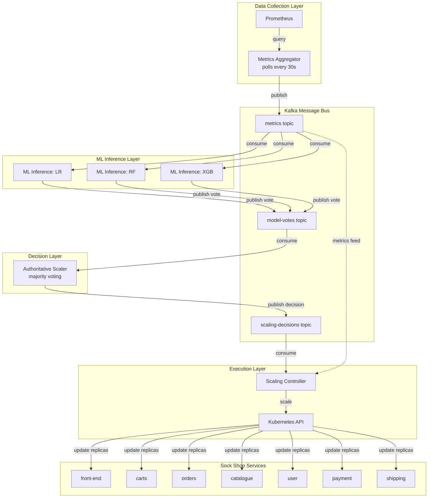
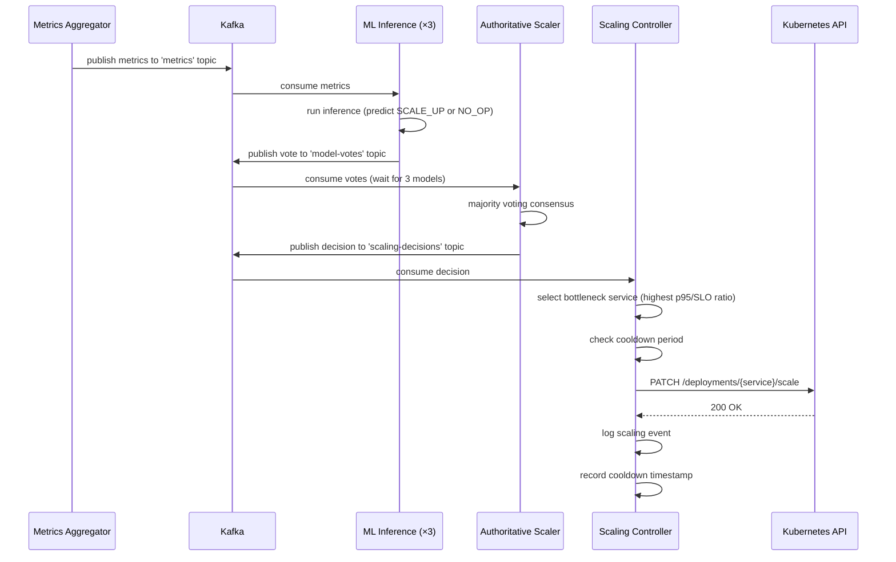
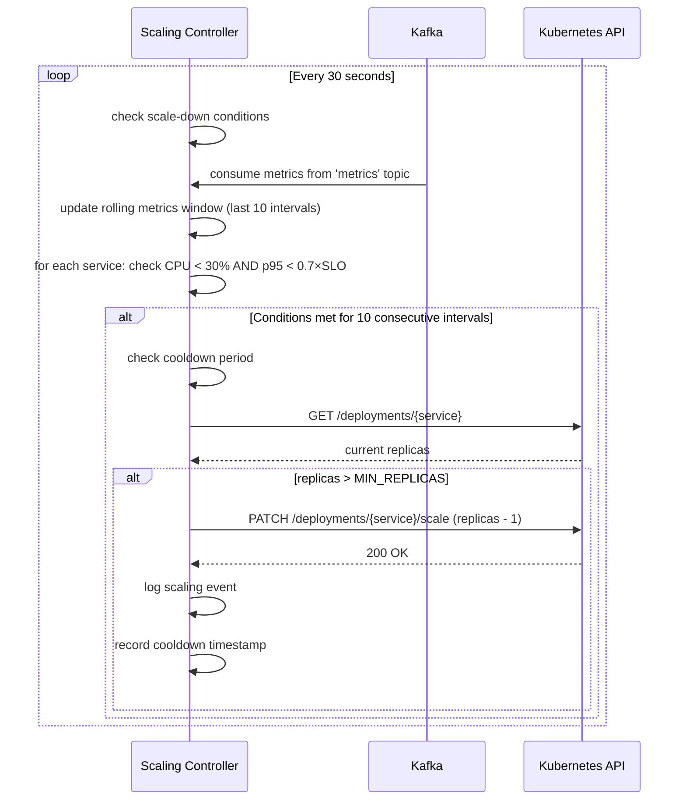

# Design Document: Proactive Autoscaler Integration

## Overview

This design document specifies the complete end-to-end integration of a proactive, context-aware microservice autoscaling system for a graduation research project. The system uses Apache Kafka as a pub/sub backbone to coordinate three ML classifiers (Logistic Regression, Random Forest, XGBoost) that consume metrics, vote on scaling decisions via majority consensus, and execute scaling actions through the Kubernetes API. The architecture is deployed on Google Kubernetes Engine (GKE) and evaluated against a reactive HPA baseline using the Sock Shop microservices benchmark across 34 experimental runs with varying load patterns.

The existing Kafka pipeline (metrics aggregator, ML inference services, authoritative scaler) is already functional. This design focuses on completing the integration by: (1) enhancing the authoritative scaler to publish decisions to Kafka, (2) implementing the scaling controller service that executes K8s API calls, (3) creating experiment orchestration and analysis tooling, and (4) establishing the reactive HPA baseline for comparison.

## Architecture



## Sequence Diagrams

### Scale-Up Flow



### Scale-Down Flow



## Components and Interfaces

### Component 1: Metrics Aggregator (Existing)

**Purpose**: Poll Prometheus every 30 seconds and publish feature vectors to Kafka

**Interface**:
```python
class MetricsAggregator:
    def collect_metrics() -> dict[str, dict]
    def build_feature_vector(service: str, metrics: dict, timestamp: str) -> dict
    def publish(feature_vector: dict) -> bool
```

**Status**: ✅ Already implemented and working

**Responsibilities**:
- Query Prometheus for request rate, latency percentiles (p50, p95, p99), CPU, memory
- Calculate delta features (rate of change)
- Determine SLA violation flag (p95 > 36ms)
- Publish to `metrics` Kafka topic

### Component 2: ML Inference Service (Existing)

**Purpose**: Consume metrics and publish model votes

**Interface**:
```python
class MLInferenceService:
    def load_model(model_path: str) -> tuple[model, parameters, metrics]
    def predict(feature_vector: dict) -> tuple[prediction, probability, confidence]
    def publish_vote(vote: dict) -> bool
```

**Status**: ✅ Already implemented, needs model files plugged in

**Responsibilities**:
- Load trained model from joblib file
- Run inference on feature vectors
- Publish vote (SCALE_UP=1 or NO_OP=0) with confidence to `model-votes` topic
- Three instances run in parallel (LR, RF, XGB)

**Model Files to Use**:
- `ML-Models/gke/models_mixed_standard/model_lr.joblib`
- `ML-Models/gke/models_mixed_standard/model_rf.joblib`
- `ML-Models/gke/models_mixed_standard/model_xgb.joblib`

### Component 3: Authoritative Scaler (Existing, Needs Enhancement)

**Purpose**: Aggregate model votes and make consensus decisions

**Interface**:
```python
class AuthoritativeScaler:
    def add_vote(vote: dict) -> None
    def should_make_decision(service: str) -> bool
    def get_votes_for_service(service: str) -> list[dict]
    def make_decision(votes: list[dict]) -> dict
    def publish_decision(service: str, decision: dict) -> bool  # NEW
```

**Status**: ⚠️ Working but only prints decisions, needs Kafka producer added

**Responsibilities**:
- Consume votes from `model-votes` topic
- Wait for votes from all 3 models (or timeout after 5 seconds)
- Apply majority voting: if ≥2 models vote SCALE_UP, decision is SCALE_UP
- **NEW**: Publish decision to `scaling-decisions` topic (not just print)

**Enhancement Required**:
```python
# Add to authoritative-scaler/app.py
from kafka_producer import DecisionsKafkaProducer

producer = DecisionsKafkaProducer(KAFKA_BOOTSTRAP_SERVERS)
producer.connect()

# In decision loop:
if producer.publish_decision(service, decision_result):
    print(f"[INFO] Published decision for {service}")
```

### Component 4: Scaling Controller (Partially Implemented)

**Purpose**: Execute scaling decisions by calling Kubernetes API

**Interface**:
```python
class ScalingController:
    def init_k8s() -> AppsV1Api
    def get_current_replicas(service: str) -> int
    def set_replicas(service: str, target: int) -> bool
    def can_scale(service: str) -> bool
    def record_scale_event(service: str) -> None
    def log_scale_event(service: str, direction: str, old: int, new: int, reason: str) -> None
    def select_bottleneck_service() -> str | None
    def handle_scale_up(service: str) -> None
    def check_scaledown() -> None
    def ingest_metric(msg_value: dict) -> None
```

**Status**: ⚠️ Partially implemented, needs testing and refinement

**Responsibilities**:
- Consume from `scaling-decisions` and `metrics` topics
- On SCALE_UP: select bottleneck service (highest p95/SLO ratio), increment replicas by 1
- On periodic check (every 30s): evaluate scale-down conditions for all services
- Enforce cooldown period (5 minutes per service)
- Enforce min/max replica bounds (1-10)
- Log all scaling events to JSONL file
- Maintain rolling metrics window for scale-down policy

**Scale-Down Policy**:
- Conditions (ALL must hold for 10 consecutive intervals):
  - CPU utilization < 30%
  - p95 latency < 0.7 × SLO threshold (25.2ms)
  - Current replicas > MIN_REPLICAS
  - Not in cooldown period
- Action: Decrement replicas by 1

**Bottleneck Selection**:
- Calculate score = p95_latency_ms / SLO_THRESHOLD_MS for each service
- Select service with highest score
- Fallback to front-end if no metrics available

### Component 5: Experiment Runner (Partially Implemented)

**Purpose**: Orchestrate 34 experimental runs with automated condition switching

**Interface**:
```python
class ExperimentRunner:
    def generate_run_schedule() -> list[ExperimentRun]
    def reset_cluster() -> None
    def enable_proactive() -> None
    def enable_reactive() -> None
    def collect_snapshot(run: ExperimentRun, interval_idx: int) -> dict
    def execute_run(run: ExperimentRun) -> Path
```

**Status**: ⚠️ Skeleton created, needs metrics collection integration

**Responsibilities**:
- Generate run schedule: 2 conditions × 4 patterns × varying repetitions = 34 runs
- Switch between proactive (scaling controller) and reactive (HPA) conditions
- Reset cluster to 1 replica before each run
- Start load generator with specified pattern
- Collect metrics snapshots every 30 seconds for 12 minutes
- Allow 3-minute settling period after load stops
- Write results to JSONL files
- Track SLO violations and replica counts

**Run Schedule**:
- Constant pattern: 2 repetitions per condition (4 runs)
- Step pattern: 5 repetitions per condition (10 runs)
- Spike pattern: 5 repetitions per condition (10 runs)
- Ramp pattern: 5 repetitions per condition (10 runs)
- Total: 34 runs × 15 minutes = ~8.5 hours

### Component 6: Results Analyzer (Partially Implemented)

**Purpose**: Parse experiment results and compute statistical comparisons

**Interface**:
```python
class ResultsAnalyzer:
    def summarise_run(jsonl_path: Path) -> dict
    def aggregate_by_condition_pattern() -> dict
    def compute_statistics() -> dict
    def generate_summary_csv() -> None
    def generate_statistics_csv() -> None
```

**Status**: ⚠️ Skeleton created, needs completion

**Responsibilities**:
- Read all .jsonl result files
- Compute per-run metrics: SLO violation rate, total replica-seconds, mean replicas, peak replicas
- Aggregate by condition × pattern
- Run Mann-Whitney U tests comparing proactive vs reactive
- Generate summary.csv (one row per run)
- Generate statistics.csv (Mann-Whitney results per metric × pattern)
- Output console table for paper

## Data Models

### Metrics Message (Kafka topic: `metrics`)

```python
{
    "timestamp": str,              # ISO 8601 UTC
    "service": str,                # e.g., "front-end"
    "request_rate_rps": float,     # requests per second
    "error_rate_pct": float,       # percentage
    "p50_latency_ms": float,
    "p95_latency_ms": float,
    "p99_latency_ms": float,
    "cpu_usage_pct": float,
    "memory_usage_mb": float,
    "delta_rps": float,            # rate of change
    "delta_p95_latency_ms": float,
    "delta_cpu_usage_pct": float,
    "sla_violated": bool           # p95 > 36ms
}
```

**Validation Rules**:
- `service` must be one of 7 monitored services
- All numeric fields must be non-negative
- `error_rate_pct` must be in range [0, 100]
- `timestamp` must be valid ISO 8601 format

### Vote Message (Kafka topic: `model-votes`)

```python
{
    "timestamp": str,
    "service": str,
    "model": str,                  # "lr", "rf", or "xgb"
    "prediction": int,             # 0 (NO_OP) or 1 (SCALE_UP)
    "probability": float,          # [0, 1]
    "confidence": float            # [0, 1]
}
```

**Validation Rules**:
- `model` must be one of ["lr", "rf", "xgb"]
- `prediction` must be 0 or 1
- `probability` and `confidence` must be in range [0, 1]

### Decision Message (Kafka topic: `scaling-decisions`)

```python
{
    "timestamp": str,
    "service": str,
    "decision": str,               # "SCALE_UP" or "NO_OP"
    "votes": list[dict],           # original votes from models
    "consensus": str,              # "unanimous", "majority", or "split"
    "vote_counts": dict            # {"SCALE_UP": int, "NO_OP": int}
}
```

**Validation Rules**:
- `decision` must be "SCALE_UP" or "NO_OP"
- `votes` must contain 1-3 vote objects
- `vote_counts` values must sum to length of `votes`

### Scaling Event Log (JSONL file)

```python
{
    "timestamp": str,
    "service": str,
    "direction": str,              # "SCALE_UP" or "SCALE_DOWN"
    "old_replicas": int,
    "new_replicas": int,
    "reason": str                  # human-readable explanation
}
```

### Experiment Snapshot (JSONL file)

```python
{
    "timestamp": str,
    "run_id": int,
    "condition": str,              # "proactive" or "reactive"
    "pattern": str,                # "constant", "step", "spike", "ramp"
    "interval_idx": int,           # 0-23
    "services": {
        "service_name": {
            "replicas": int,
            "p95_ms": float,
            "cpu_pct": float,
            "slo_violated": bool
        }
    }
}
```

## Error Handling

### Error Scenario 1: Kafka Connection Failure

**Condition**: Kafka broker unreachable or topic does not exist
**Response**: Service logs error and retries connection with exponential backoff (max 60s)
**Recovery**: Once Kafka is available, service resumes normal operation

### Error Scenario 2: Kubernetes API Permission Denied

**Condition**: Scaling controller lacks RBAC permissions to scale deployments
**Response**: Log error with specific permission required, skip scaling action
**Recovery**: Apply correct RBAC manifest and restart controller

### Error Scenario 3: Model File Not Found

**Condition**: ML inference service cannot load model from specified path
**Response**: Log error and exit with non-zero status code
**Recovery**: Mount correct model files and restart service

### Error Scenario 4: Incomplete Model Votes

**Condition**: Only 1 or 2 models vote within decision window (5 seconds)
**Response**: Make decision based on available votes (majority of received votes)
**Recovery**: Log warning about incomplete votes, continue operation

### Error Scenario 5: Deployment Not Found

**Condition**: Scaling controller tries to scale non-existent deployment
**Response**: Log error, skip scaling action for that service
**Recovery**: Verify deployment exists in namespace, continue with other services

### Error Scenario 6: Replica Bounds Violation

**Condition**: Scaling action would exceed MIN_REPLICAS or MAX_REPLICAS
**Response**: Clamp to bounds, log warning
**Recovery**: No recovery needed, system continues normally

## Testing Strategy

### Unit Testing Approach

Each component has isolated unit tests:

1. **Metrics Aggregator**: Mock Prometheus responses, verify feature vector construction
2. **ML Inference**: Mock model predictions, verify vote formatting
3. **Authoritative Scaler**: Test majority voting logic with various vote combinations
4. **Scaling Controller**: Mock K8s API, verify bottleneck selection and cooldown logic
5. **Experiment Runner**: Mock K8s API and load generator, verify run scheduling

Coverage goal: >80% for core logic

### Integration Testing Approach

End-to-end smoke tests:

1. **Kafka Pipeline Test**: Publish test metrics → verify votes → verify decision
2. **Scaling Action Test**: Publish SCALE_UP decision → verify replica count changes
3. **Scale-Down Test**: Inject low CPU/latency metrics → verify scale-down after 10 intervals
4. **Cooldown Test**: Trigger scale event → verify subsequent scale blocked for 5 minutes
5. **Condition Switching Test**: Enable proactive → verify HPA deleted and controller running; enable reactive → verify opposite

### Experiment Validation

Before running full 34-run experiment:

1. **Single Run Test**: Execute one proactive and one reactive run manually
2. **Metrics Collection Test**: Verify all 7 services have metrics in snapshots
3. **Load Generator Test**: Verify each pattern (constant, step, spike, ramp) produces expected load shape
4. **Results Parsing Test**: Verify analyzer can parse snapshot files and compute metrics

## Performance Considerations

**Polling Interval**: 30 seconds balances responsiveness with Prometheus query load

**Decision Latency**: End-to-end latency from metric collection to scaling action:
- Metrics aggregation: 0-30s (depends on polling cycle)
- ML inference: <1s (3 models in parallel)
- Vote aggregation: 0-5s (decision window)
- Scaling execution: <2s (K8s API call)
- Total: 2-38 seconds (average ~20s)

**Kafka Throughput**: At 30s polling with 7 services:
- Metrics topic: 14 messages/min (7 services × 2 messages/min)
- Votes topic: 42 messages/min (7 services × 3 models × 2 messages/min)
- Decisions topic: 14 messages/min (7 services × 2 messages/min)
- Total: 70 messages/min (well within Kafka capacity)

**Resource Usage**:
- Metrics Aggregator: 100m CPU, 128Mi memory
- ML Inference (×3): 200m CPU, 256Mi memory each
- Authoritative Scaler: 100m CPU, 128Mi memory
- Scaling Controller: 100m CPU, 128Mi memory
- Total: 1.1 CPU cores, 1.28 GB memory

## Security Considerations

**Kubernetes RBAC**: Scaling controller uses dedicated ServiceAccount with minimal permissions:
- `get`, `list`, `patch`, `update` on `deployments` and `deployments/scale`
- `get`, `list` on `pods`
- No cluster-admin or namespace-admin privileges

**Kafka Security**: In production, enable:
- SASL/SCRAM authentication
- TLS encryption for broker connections
- ACLs restricting topic access per service

**Secrets Management**: Model files and Kafka credentials stored in Kubernetes Secrets, mounted as volumes (not environment variables)

**Network Policies**: Restrict traffic:
- Metrics Aggregator → Prometheus only
- ML Inference → Kafka only
- Scaling Controller → Kafka and K8s API only

## Dependencies

**External Services**:
- Apache Kafka 3.x (message bus)
- Prometheus (metrics source)
- Kubernetes 1.25+ (orchestration platform)
- Google Kubernetes Engine (cloud infrastructure)

**Python Libraries**:
- `confluent-kafka` 2.x (Kafka client)
- `kubernetes` 28.x (K8s Python client)
- `scikit-learn` 1.3.x (model loading)
- `xgboost` 2.0.x (XGBoost model)
- `joblib` 1.3.x (model serialization)
- `scipy` 1.11.x (statistical tests)
- `numpy` 1.24.x (numerical operations)

**Sock Shop Benchmark**:
- Microservices Demo (Weaveworks)
- Deployed in `sock-shop` namespace
- 7 monitored services: front-end, carts, orders, catalogue, user, payment, shipping

**Load Generator**:
- Locust or custom load generator
- Supports 4 patterns: constant, step, spike, ramp
- Configurable duration and intensity

## System Configuration

**Deployment Environment**:
- Platform: Google Kubernetes Engine (GKE)
- Region: us-central1
- Node pool: 3× e2-standard-4 (4 vCPU, 16 GB RAM each)
- Namespace: sock-shop

**Autoscaling Parameters**:
- SLO threshold: 36ms (p95 latency)
- Polling interval: 30 seconds
- Lookahead window: 2 intervals (60 seconds)
- Min replicas: 1
- Max replicas: 10
- Cooldown period: 5 minutes
- Scale-down CPU threshold: 30%
- Scale-down latency ratio: 0.7 × SLO (25.2ms)
- Scale-down window: 10 consecutive intervals (5 minutes)

**Experiment Configuration**:
- Total runs: 34
- Conditions: proactive (scaling controller) vs reactive (HPA)
- Patterns: constant (2 reps), step (5 reps), spike (5 reps), ramp (5 reps)
- Run duration: 12 minutes load + 3 minutes settle = 15 minutes
- Total experiment time: ~8.5 hours
- Metrics collection: 24 snapshots per run (every 30s)

**Reactive HPA Baseline**:
- Metric: CPU utilization
- Target: 70% average utilization
- Scale-down stabilization: 300 seconds (5 minutes)
- Same min/max replicas as proactive system

## Implementation Status

**✅ Completed**:
1. Metrics Aggregator service (polls Prometheus, publishes to Kafka)
2. ML Inference service (consumes metrics, publishes votes)
3. Authoritative Scaler (aggregates votes, makes decisions)
4. ML models trained (GKE mixed standard: LR, RF, XGB)
5. Scaling Controller skeleton (K8s API integration)
6. Experiment Runner skeleton (run scheduling)
7. K8s RBAC manifests (ServiceAccount, ClusterRole, ClusterRoleBinding)
8. HPA baseline manifest (7 services with CPU-based autoscaling)

**🔨 In Progress**:
1. Authoritative Scaler enhancement (add Kafka producer for decisions topic)
2. Scaling Controller refinement (test bottleneck selection, scale-down policy)
3. Experiment Runner completion (integrate metrics collection)
4. Results Analyzer completion (statistical analysis)

**❌ To Do**:
1. Plug in correct model files to ML inference services
2. End-to-end smoke test of full pipeline
3. Validate metrics collection in experiment runner
4. Integrate load generator with experiment runner
5. Complete results analyzer implementation
6. Deploy to GKE and run validation experiments
7. Execute full 34-run experiment suite
8. Generate final results for paper

## Next Steps (Priority Order)

1. **Verify Kafka Pipeline**: Test end-to-end flow from metrics → votes → decisions
2. **Plug in Models**: Update ML inference service deployments to mount correct model files
3. **Enhance Authoritative Scaler**: Add Kafka producer to publish decisions
4. **Test Scaling Controller**: Verify scale-up and scale-down logic with manual triggers
5. **Complete Experiment Runner**: Integrate actual metrics collection (Prometheus or Kafka)
6. **Complete Results Analyzer**: Implement statistical analysis and CSV generation
7. **Smoke Test Full System**: Run single proactive and reactive experiments
8. **Deploy to GKE**: Apply all manifests and verify services running
9. **Validation Runs**: Execute 2-3 test runs to verify data collection
10. **Pause for Review**: Confirm everything ready before overnight experiment run
11. **Execute Full Experiment**: Run all 34 experiments
12. **Analyze Results**: Generate summary statistics and comparison tables
13. **Document Findings**: Write results section for paper

## Critical Notes

1. **Model Files**: Use `ML-Models/gke/models_mixed_standard/model_{lr,rf,xgb}.joblib` (NOT leave-one-out models)
2. **Kafka Topics**: Codebase topic names are authoritative (not spec names)
3. **Virtual Environment**: Use existing venv at `kafka-structured/services/metrics-aggregator/venv/`
4. **Python Version**: Do NOT use MSYS Python (will not work)
5. **Overnight Runs**: Pause before starting to confirm readiness
6. **Documentation**: Only document what's necessary for paper (no LLM fluff)
7. **Codebase Structure**: Adapt to existing structure (don't copy-paste from plan)
8. **GKE Deployment**: System runs on cloud to compare HPA vs proactive solution

